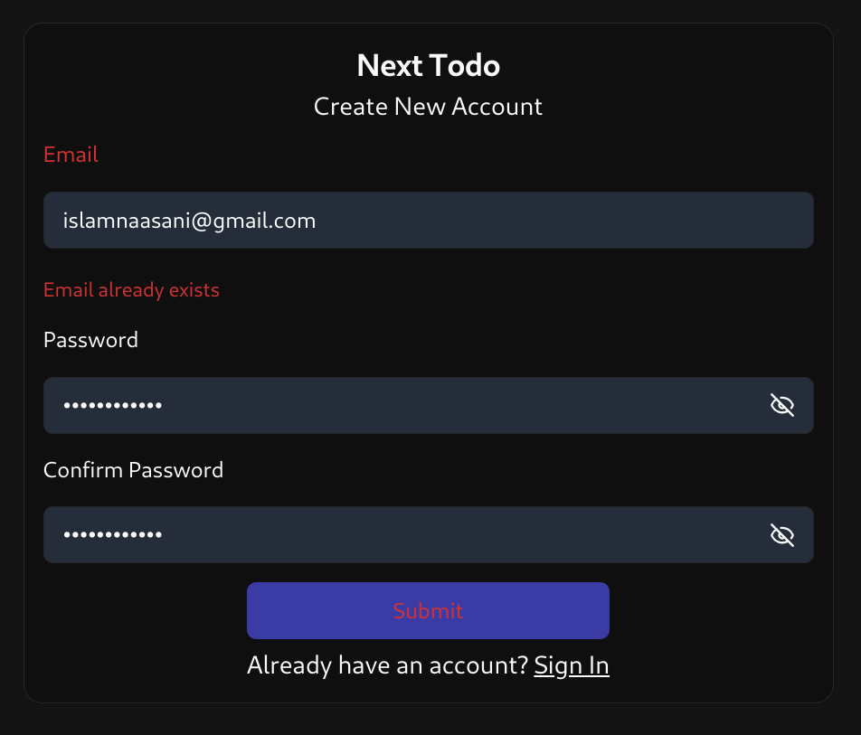
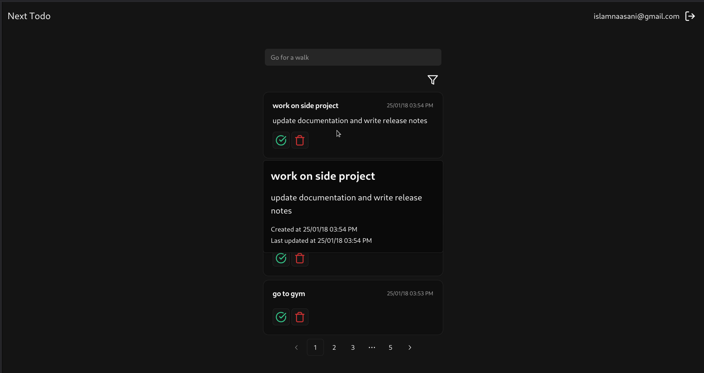
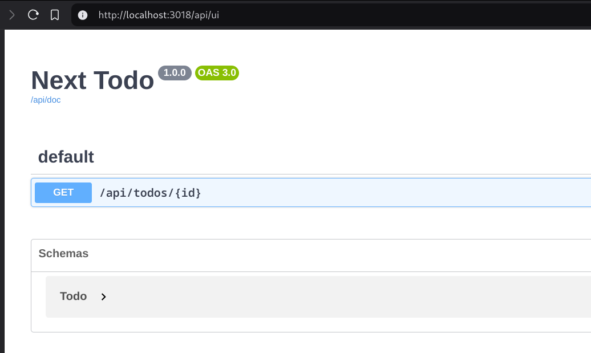

{/* START doctoc generated TOC please keep comment here to allow auto update */}
{/* DON'T EDIT THIS SECTION, INSTEAD RE-RUN doctoc TO UPDATE */}
**Table of Contents** {/* generated with [DocToc](https://github.com/thlorenz/doctoc) */}

- [What does Next.js overlook?](#what-does-nextjs-overlook)
- [Server Components and the state problem](#server-components-and-the-state-problem)
- [Server Functions](#server-functions)
  - [Code organization](#code-organization)
  - [Validation and error handling](#validation-and-error-handling)
- [Route Handlers and the non-existing type-safety](#route-handlers-and-the-non-existing-type-safety)
- [Conclusion](#conclusion)

{/* END doctoc generated TOC please keep comment here to allow auto update */}

## What does Next.js overlook?

Building fullstack apps with Next.js is fun (except the painfully slow development time), but I find some parts of the core features a bit lacking in some domains, like type-safety, how to approach large forms, and working with non-trivial back-ends.

In this article, I'll display some of the problems I faced when working with Next.js, and how I approached them. This article is _not_ a Next.js tutorial, I'll be assuming you're familiar with Next.js App Router core features, including [Server Components](https://react.dev/reference/rsc/server-components), [Server Functions (Server Actions)](https://react.dev/reference/rsc/server-functions) and [Route Handlers](https://nextjs.org/docs/app/building-your-application/routing/route-handlers).

Also I'll be using code snippets from a starter project I wrote previously, the project is a simple To Do application that have a maintainable code structure coupled with good base libraries to use, You can refer to the source code on github [github.com/I-3B/next-todo](https://github.com/I-3B/next-todo) (where you can also follow the README to get started) and deployed on Vercel [next-todo-i-3b.vercel.app](https://next-todo-i-3b.vercel.app/).

## Server Components and the state problem

Fetching data with server components can't be more straightforward:

```tsx {2}
export async function TodoList() {
  const todos = await api.todo.findMany();

  return (
    <Stack gap="list">
      {todos.data.map((todo) => (
        <TodoItem todo={todo} key={todo.id} />
      ))}
      {todos.count == 0 && (
        <p className="my-10 text-center text-lg">No todos found</p>
      )}
      <PaginationButtons dataCount={todos.count} />
    </Stack>
  );
}
```

And that's it, no API layer to worry about, you can write db queries right here! but let's say we want to add filtration to our To Do list, we would like to have a status (`all`, `completed`) and searching filters combined with pagination:

<video controls autoplay muted>
  <Source src="search-params.webm" type="video/webm" />
</video>

now, we can't use `useState` here (remember, this is a server component), so what is the state that the server can see? the URL, in this case [Search Params](https://developer.mozilla.org/en-US/docs/Web/API/URLSearchParams)

Next.js do offer a [`useSearchParams`](https://nextjs.org/docs/app/api-reference/functions/use-search-params) hook, but it leaves much to be desired, it doesn't provide any type-safety, updating the URL is very cumbersome, and you have to worry about parsing and casting the params, I don't think this should be used directly in any production app. Instead, we should opt for type-safe solutions like [nuqs](https://nuqs.47ng.com/).

Using nuqs, the search params schema will will be something like this:

```ts
import { todoStatusEnum } from "@/services/todo/schemas/find-many";
import {
  createSearchParamsCache,
  parseAsString,
  parseAsStringLiteral,
} from "nuqs/server";
import { paginationParser } from "../shared/pagination-search-params";

export const todoParser = {
  ...paginationParser,
  status: parseAsStringLiteral(todoStatusEnum)
    .withDefault("all")
    .withOptions({ shallow: false, clearOnDefault: true }),
  search: parseAsString
    .withDefault("")
    .withOptions({ shallow: false, clearOnDefault: true }),
};
export const todoParserCache = createSearchParamsCache(todoParser);
```

- `shallow: false` so it triggers a network request to the server on change
- `clearOnDefault: true` so default states will be omitted (`?status=all`)

Now the usage:

`components/todo/todo-filter.tsx`

```tsx
  const [filter, setFilter] = useQueryStates(todoParser);
// ...
  <InputDebounced
    value={filter.search}
    onChange={(search) => {
      setFilter({ search, page: 1 });
    }}
    placeholder="Search"
  />
  <Button
    size="icon"
    variant="outline"
    onClick={() => {
      setFilter(({ status }) => ({
        status: status === "all" ? "completed" : "all",
        page: 1,
      }));
    }}
  >
    <CheckCircle
      className={cn(filter.status === "completed" && "text-success")}
    />
  </Button>
```

`app/(protected)/(index)/page.tsx`

```tsx
export default async function Page({ searchParams }: PageProps) {
  todoParserCache.parse(await searchParams);
  return (
    <div className="...">
      <TodoCreateForm />
      <TodoFilter />
      <TodoList filter={todoParserCache.all()} />
    </div>
  );
}
```

As you can see, after defining the schema, you will interact with it like a normal `useState` hook, and it's fully type-safe.

## Server Functions

I want to talk about two things: organizing code, and validation.

### Code organization

Server Functions (Server Actions pre React 19) are pretty cool, you start a file with "use server" and every exported function is now a POST endpoint that can be used directly from client-side code. Now, if your back-end is not a CRUD of a couple of resources, this will come out of hand really quickly:

1. If we provide all back-end POST endpoints as top-level exported functions, you can imagine how many function you will have to search from in large codebase to find the action you need to use, also we will lose the self-documenting nature that modules have:
   <Image
     linkClassName="aspect-[5]"
     alt="api.todo available functions"
     src="services-autocomplete.png"
   />
2. Colocating the action logic besides the UI component is also a bad idea, as it will couple the logic with the component, so it will be a bit messy to reuse those actions with other components.

We would like to have both, colocation and a modular structure for back-end services, so I tried to re-export the server function like this:

`app/auth/register/action.ts`

```ts
"use server";
import { serverAction } from "@/lib/server-action";
import { api } from "@/services/api";

export default api.auth.register
```

Oops, got an error:

```log

 ⨯ ./app/auth/register/action.ts:4:1
Ecmascript file had an error
  2 | import { api } from "@/services/api";
  3 |
> 4 | export default api.auth.register;
    | ^^^^^^^^^^^^^^^^^^^^^^^^^^^^^^^^^
  5 |

Only async functions are allowed to be exported in a "use server" file.
```

Okay, it just has to recognize the export as an async function:

```ts {1}
export default serverAction(api.auth.register);
```

And it works now, you might not like how this look, but for me it's better than exporting all actions that the back-end provides, also this `serverAction` wrapper serves another purpose, error handling.

### Validation and error handling

While the [suggested way in the docs](https://react.dev/reference/rsc/server-functions#using-server-functions-with-form-actions) for writing forms is great for [progressive enhancement](https://nextjs.org/docs/app/building-your-application/data-fetching/server-actions-and-mutations#behavior), in many contexts, it's not as important (dashboards where forms tend to be large and complex), I think this approach works great for register forms, or survey ones, for anything other than that, you have to consider complex validation, displaying deeply nested errors and so on, I would recommend using React Hook Form unless you have specific requirements.

Another issue I found with Server Functions is status codes! any error thrown inside the action will just return `500` status code to the front-end, and you can't even return a response body with it!

Before seeing how we can overcome this, let's continue with our `api.auth.register` function, say we want to show an "email already exists" error message:



For this, we need to throw a custom error:

```ts
if (emailExist)
  throw new AppError({
    message: "Validation Error",
    status: "BAD_REQUEST",
    validationErrors: { email: errMsgFactory.exists("email") },
  });
```

But this error object won't be sent to the client-side, only the error message will be sent:

```log
Error: Validation Error
    at register (index.ts:30:13)
    at async default (server-action.ts:7:20)
```

This is a security measure to prevent any sensitive data from leaking, which is good, but then we still want to throw errors that have more than just a message, what we can do is catch the error **inside** the server action, and forward it to client-side as a normal object, this is where our `serverAction` wrapper comes in handy, now looking at `serverAction` implementation:

`lib/server-action.ts`

```ts {8-13}
export function serverAction<TArgs extends any[], TReturn>(
  fn: (...args: TArgs) => Promise<TReturn>,
) {
  return async (...args: TArgs) => {
    try {
      const result = await fn(...args);
      return { result };
    } catch (error) {
      if (error instanceof AppError) {
        return { error: JSON.parse(JSON.stringify(error)) as AppError };
      }
      throw error;
    }
  };
}
```

If the error is what we expect (`AppError`), then send it as an object to front-end, if not, re-throw the error, and it won't be visible fully for the client now, which is ok in this case.

Now inside the form, we can check for errors this way:

```ts
const response = await action(...)
if (response.error) {
  const error = response.error
  if (error.message) {
      toast.error(error.message, {
        description: error.statusCode && `Request Failed - ${error.statusCode}`,
      });
    }
  if (error.validationErrors) {
    // iterate over back-end validation errors and show them inside the form.
    Object.entries(error.validationErrors).forEach(([field, message]) => {
      form.setError?.(field, {
        message,
      });
    });
  }
}
```

> You also also abstract a function to handle this for you, you can check the implementation of [registration page](https://github.com/I-3B/next-todo/blob/main/app/auth/register/register-form.tsx#L52) for an example.

## Route Handlers and the non-existing type-safety

Server Components are enough in a lot of cases, but sometimes we need to fetch data on the client-side, say fetching data on mouse hover.



But before we can fetch on client-side we need to have endpoints to call, meaning [Route Handlers](https://nextjs.org/docs/app/building-your-application/routing/route-handlers), but I have a few problems with them:

- No type-safety whatsoever, you have to use a raw fetch with the URL written by hand...yikes
- There's no native way to provide an OpenAPI Specification (Swagger), you can use something like [next-swagger-doc](https://www.npmjs.com/package/next-swagger-doc) but the DX is terrible, so codegen tools like [Orval](https://orval.dev/) are out of the question, it will also be hard to provide a documentation for your API for third party usage.
- This is just a personal opinion, but I don't like using Next.js file based routing for API routes (I'm Express.js guy)

Luckily, we have alternatives, I've tried out two: [Hono](https://hono.dev/), [ElysiaJs](https://elysiajs.com/), Hono is more established and more stable, so I would suggest you have a look at it.

Using Hono will give us the following:

- Type-safe [RPC](https://hono.dev/docs/guides/rpc) to use on the client.
- [OpenAPI specification](https://hono.dev/examples/zod-openapi) using zod with a [Swagger UI](https://hono.dev/examples/swagger-ui).
- Express.js like [routing system](https://hono.dev/docs/api/routing).

You can find how to setup in the links above, of course you can check [the example](https://github.com/I-3B/next-todo/blob/main/app/api/%5B%5B...route%5D%5D/route.ts) to see the full setup.

After setup, let's define the endpoint:

`app/api/[[...route]]/todo.ts`

```ts
export const todoAPI = new OpenAPIHono().openapi(
  createRoute({
    method: "get",
    path: "/{id}",
    request: { params: todoFindOneParamSchema },
    responses: {
      200: {
        description: "Todo details",
        content: {
          "application/json": { schema: todoFindOneResponseSchema },
        },
      },
    },
  }),
  async (c) => c.json(await api.todo.findOne(c.req.valid("param"))),
);
```

`app/api/[[...route]]/route.ts`

```ts
app.route("/todos", todoAPI);
```

Now the endpoint is available in Swagger:


And we can call it as a RPC:

`components/todo/queries.ts`

```ts {8}
export const todoQueries = {
  rootKey: () => ["todo"],

  detailsKey: () => [todoQueries.rootKey(), "details"],
  details: (param: TodoFindOneParamSchema) =>
    queryOptions({
      queryKey: [...todoQueries.detailsKey(), param],
      queryFn: () => qw(rpc.todos[":id"].$get)({ param }),
    }),
};
```

Which can be used this way:

```ts
const query = useQuery(todoQueries.details({ id }));
```

Fully type-safe & documented with a good DX.

## Conclusion

Next.js App Router offers a powerful paradigm for building fullstack applications, but it can be better, such as providing a better way to manage search param state (it can learn from [TanStack Router](https://tanstack.com/router)) and making server functions behave in a more expected way (using only POST method which always returning 200 may not be the best idea) and finally integrating a native way to write OpenAPI specifications, which in my opinion is a low hanging fruit.

That's a Wrap! I hope this article was helpful to you, if you have any improvements or you have noticed something I've missed, please let me know, you can also check out the example I mentioned for a production-ready full-stack app.
