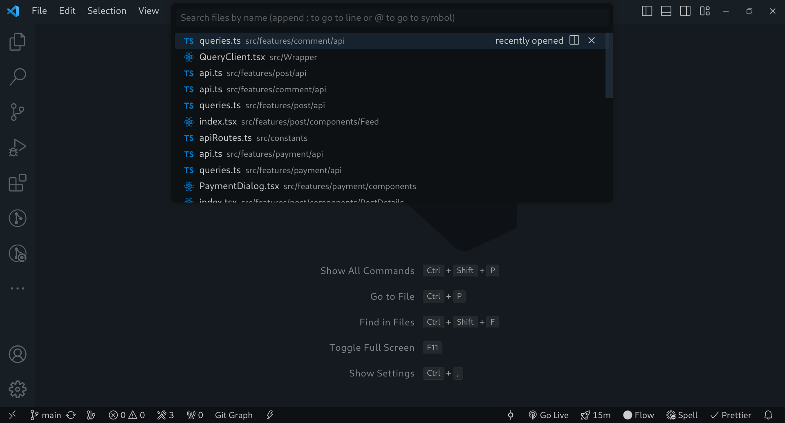

I've put in this post a few vscode features and how I use them on a daily basis, this isn't a list of vscode tips and shortcuts, I think there is enough of those on the internet, although I did include [two shortcuts](#honorable-mentions) that I think a lot of developers are sleeping on.

**As this is just a bunch of personal thoughts and usages of popular vscode features, I'll not talk about the available options and how to use them, but I did include the documentation link when needed.**

{/* START doctoc generated TOC please keep comment here to allow auto update */}
{/* DON'T EDIT THIS SECTION, INSTEAD RE-RUN doctoc TO UPDATE */}

- [Code Snippets](#code-snippets)
- [Quick Navigation](#quick-navigation)
- [RegEx Search and Replace](#regex-search-and-replace)
- [Tasks](#tasks)
- [Honorable Mentions](#honorable-mentions)
  - [Smart code selection](#smart-code-selection)
  - [Select Matches](#select-matches)

{/* END doctoc generated TOC please keep comment here to allow auto update */}

## Code Snippets

What I love about code snippets—aside from productivity—is how they make you follow coding conventions without the need of you to be conscious of them, so if you want component functions, for example, to be defined in a specific way, setting a code snippet here would be beneficial.

Let's see how that would work out with some conventions that you may want:

- A component should be defined as an arrow function.
- types should be used over interfaces.
- only named exports should be used.
- components are named the same as the file they are in (for the main component in the file).

The following code snippet can do the required:

```json:.vscode/React.code-snippets
{
  "Functional Component by filename": {
    "scope": "typescriptreact",
    "prefix": "fcf",
    "body": [
      "export type ${TM_FILENAME_BASE/(.*)/${1:/pascalcase}/}$1Props = {};",
      "export const ${TM_FILENAME_BASE/(.*)/${1:/pascalcase}/}$1 = ({}: ${TM_FILENAME_BASE/(.*)/${1:/pascalcase}/}$1Props) => {",
      " $2",
      "};"
    ],
    "description": "Create a functional component by the filename"
  }
}
```

The code generated from the snippet:

```tsx:drop-down.tsx
export type DropDownProps = {};
export const DropDown = ({}: DropDownProps) => {

};
```

There is a lot of cool things you can do with code snippets, give [the documentation](https://code.visualstudio.com/docs/editor/userdefinedsnippets) a quick read.

## Quick Navigation

By quick navigation I mean when you press `Ctrl + P` or `Ctrl + E` and search for files:



I think a lot of developers already use this, nothing new here, but what I want to talk about is using a file structure that will enhance your experience using the quick navigation.

What is great about quick navigation, is that you only need to type some parts of the path but still isn't a fuzzy search, for example if we have a file named `drop-down.tsx`, `drdo` would match as they are a correct character sequence in the path <Code><u>**dr**</u>op-<u>**do**</u>wn.tsx</Code> but `dorp` won't match as there isn't any character sequence like that.

Therefore, if you structure your files in a hierarchial, consistent way, you would be able to type some sections of the path and get what you're searching for, consider a file tree like this:

```bash
src/features
├── comment
│   ├── api
│   │   ├── api.ts
│   │   ├── queries.ts
│   │   └── type.ts
│   ├── components
│   │   ├── CommentCard.tsx
│   │   ├── CommentForm
│   │   │   ├── index.tsx
│   │   │   └── validation.ts
│   │   └── CommentsDrawer.tsx
│   └── index.ts
└── post
    ├── api
    │   ├── api.ts
    │   ├── queries.ts
    │   └── type.ts
    └── components
        ├── Feed
        │   ├── index.tsx
        │   └── PostCard.tsx
        ├── PostAddForm
        │   ├── helpers.ts
        │   ├── index.tsx
        │   ├── type.ts
        │   └── validation.ts
        └── PostEditForm
            ├── helpers.ts
            ├── index.tsx
            ├── type.ts
            └── validation.ts
```

You want to open the API types for the post feature `src/features/post/api/type.ts`, just type "posttype" and you get what you want! (nearly)


And that's one of the reasons why I like a feature-based, colocated file structure rather than one by layers (MVC), my reason is that a feature-based approach is more intuitive when trying to find a file, you type `post` and processed to narrow the search the more you type.

This also works really well with a file-system based routing (Next.js, Expo...), just type a segment or two of the route you want and you would find your file.

If you aren't already using quick navigation, start using it! I hope I was able to convince you to do so, it's quite the game changer, so try to get yourself comfortable with it!

## RegEx Search and Replace

This is helpful when you're changing a lot of similar lines of code repeatedly, for example, I use this when I'm changing my imports from static import:

```js
import Page from "src/page";
```

To React's lazy import:

```js
const Page = lazy(() => import("src/page"));
```

There is only two parts that are changing, the import name and the import string, easy to automate with regex.

- Let's write the search regex:

```regex
import (.*) from "(.*)"
```

- And what to replace it with:

```regex
const $1 = lazy(() => import("$2"))
```

<Image
  src="static-to-lazy.png"
  alt="Static to lazy import"
  linkClassName="aspect-[3]"
/>
And We can do it in reverse too! Lazy to static:
<Image
  src="lazy-to-static.png"
  alt="Lazy to Static import"
  linkClassName="aspect-[3]"
/>

You may be thinking that it's cumbersome to do this every time you need to replace a bunch of lines (who wants to write regex?🫠), and I agree with that, so I save the search and replace strings on my notes app and copy-paste them when needed. If you find yourself doing something similar repeatedly, maybe you can automate it with a regex.

Read [this section](https://code.visualstudio.com/docs/editor/codebasics#_case-changing-in-regex-replace) in [the documentation](https://code.visualstudio.com/docs/editor/codebasics) to see another example, and while you are there, read the whole page!

## Tasks

> Lots of tools exist to automate tasks like linting, building, packaging,
> testing, or deploying software systems. Examples include the TypeScript Compiler,
> linters like ESLint and TSLint as well as build systems like Make, Ant, Gulp, Jake, Rake, and MSBuild.

⋮

> Given their importance in the development life cycle, it is helpful to be able to run tools and analyze their results from within VS Code.

I think the most common usage of vscode tasks is starting a dev server or a build, which is how I use them, but with `"runOn": "folderOpen"` option in `.vscode/tasks.json`, which is really cool!

My day to day work always include:

1. opening the project workspace.
1. starting the dev server.
1. opening localhost.

I found it annoying to always run the dev server manually, as usually whenever I open the workspace for the project, I'll also start the dev server, and here where tasks can help, this is a `tasks.json` I use for one of my projects:

```json:tasks.json showLineNumbers {26,31}
{
  "version": "2.0.0",
  "tasks": [
    {
      "label": "Types generation",
      "type": "shell",
      "command": "pnpm",
      "args": ["swagger"],
      "group": "none",
      "presentation": {
        "reveal": "never",
        "panel": "dedicated",
        "focus": false
      },
      "runOptions": {
        "runOn": "folderOpen"
      }
    },
    {
      "label": "Development",
      "type": "shell",
      "command": "pnpm",
      "args": ["dev"],
      "group": "none",
      "presentation": {
        "reveal": "always",
        "panel": "dedicated",
        "focus": false
      },
      "runOptions": {
        "runOn": "folderOpen"
      }
    }
  ]
}
```

As for `"reveal": "always"`, this one for opening the terminal panel after running the task, which is nice if you want to click on the localhost link or you want to see some sort of result.


{/* TODO add link to swagger article */}

I would use `"reveal": "never"` if I don't care about the results of the command, for example, I generate swagger types using [orval.dev](https://orval.dev/) on every folder open, but I want this to run in background as it's not that important, so I use `"reveal": "never"` for it.

Please checkout [the documentation](https://code.visualstudio.com/docs/editor/tasks) to see all options.

## Honorable Mentions

While I said this won't be an exhaustive list for vscode tips and shortcuts, I think the following shortcuts aren't used as much as I think they should be.

### Smart code selection

I always use it, and I feel annoyed when I'm typing something outside of vscode and try to use the shortcut out of habit, just look at this:

<video controls>
  <Source src="smart-code-selection.webm" type="video/webm" />
</video>

### Select Matches

`Ctrl + D` for selecting the next Find Match and `Ctrl + Shift + L` for selecting all occurrences of Find Match.

<video controls>
  <Source src="select-match.webm" type="video/webm" />
</video>

<hr />

Okay, that's it! if you would like to discuss this post, reach me out on [LinkedIn](https://www.linkedin.com/in/islam-nassani-994a32194) or [Twitter](https://twitter.com/i_3b___), I would love to!

Till next time 👋
