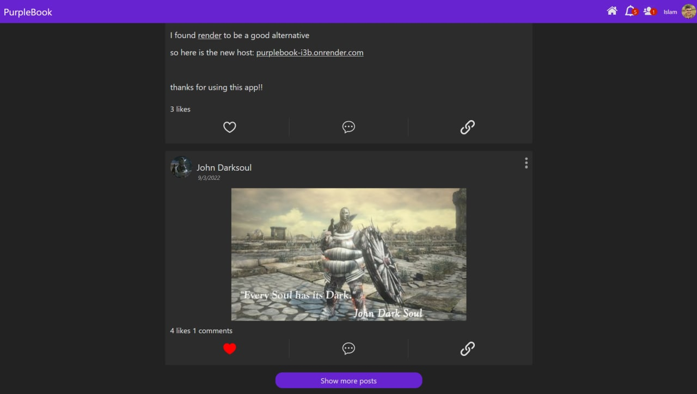
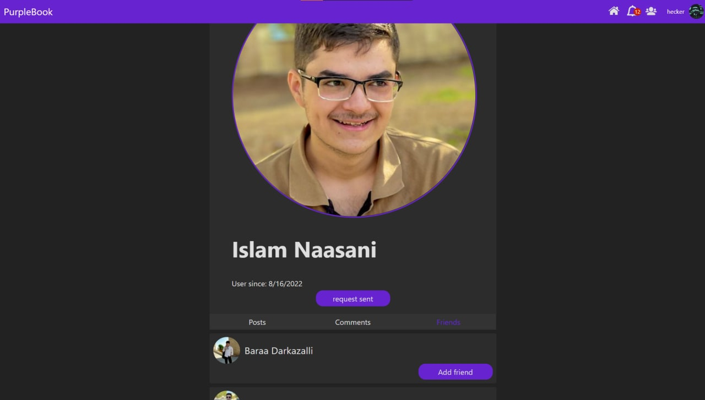
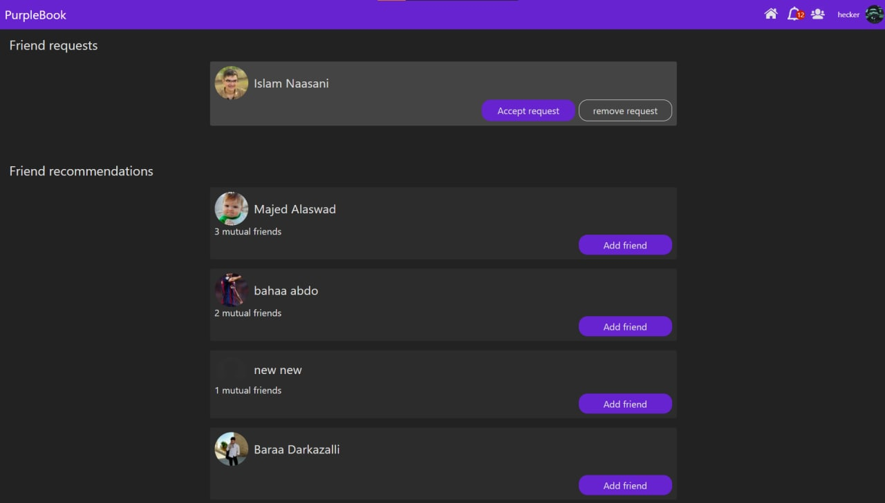

## About

a Facebook clone with the core features (posts, likes, comments, friends), this project was the final project of [The Full Stack JavaScript Course](https://www.theodinproject.com/paths/full-stack-javascript) from [theodingproject.com](https://www.theodingproject.com)

I did both of the back-end and the front-end.

- Live: [purplebook-i3b.onrender.com](https://purplebook-i3b.onrender.com/)
- API documentation: [Postman](https://documenter.getpostman.com/view/18509081/VUxXLj6o)
- To review the back-end code: [github.com/i-3b/purpleBook-API](https://github.com/i-3b/purpleBook-API)
- To review the front-end code: [github.com/i-3b/purpleBook-client](https://github.com/i-3b/purpleBook-client)

### Back-end

- first time using Typescript for back-end
- Wrote unit tests (around 200 test) using Jest.
- Oauth2 (login with Facebook)
- Complex MongoDB aggregation pipelines (queries) the most challenging was friend recommendations query.

### Front-end

- I tried to make components reusable as often as I can (cards, buttons, a hook for paged lists).
- I used more SCSS features (extending classes, variables, partials).

## Gallery

p]:grid [&>p]:gap-1 [&>p]:md:grid-cols-2 [&_*]:m-0">
     

