## About

The main objective of the platform is to centralize the management of operations and automate the booking processes. I was responsible for building the admin dashboard and the user application.

### User Application

- The ability to view and visualize trips based on their status, whether they are upcoming, ongoing, or completed.
- Notification service for general announcements and updates about trips.
- Booking seats in a trip in realtime.
- Responsive. Can work on any device.
- Behaves as a native application (PWA).

p]:grid [&>p]:gap-1 [&>p]:md:grid-cols-2 [&_*]:m-0">
  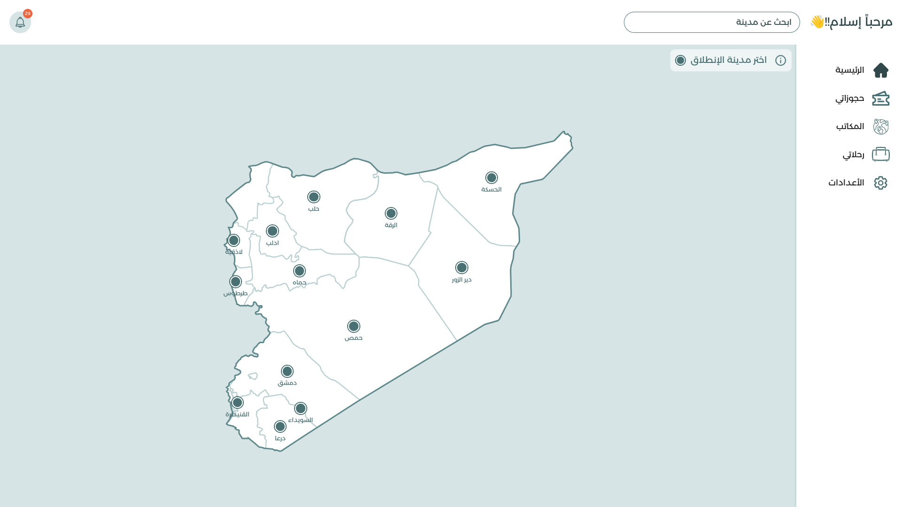 

p]:grid [&>p]:gap-1 [&>p]:sm:grid-cols-3 [&_*]:m-0 [&_a]:aspect-[9/16]">
  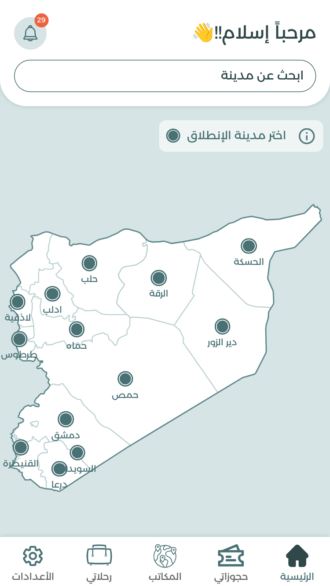 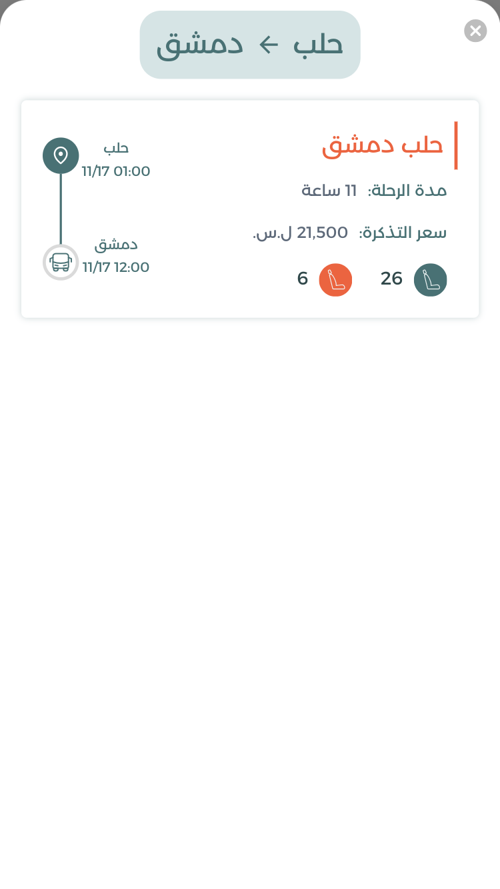  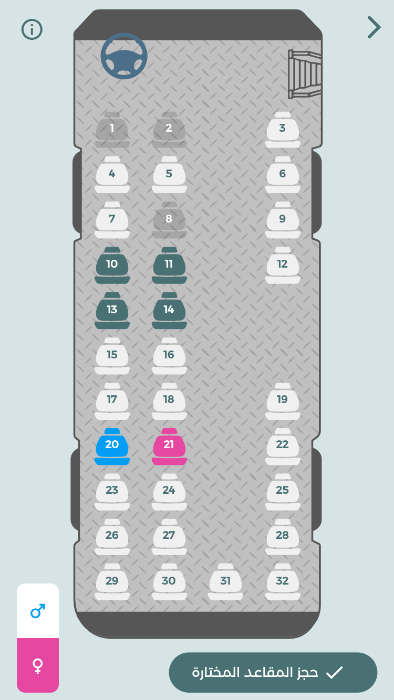
  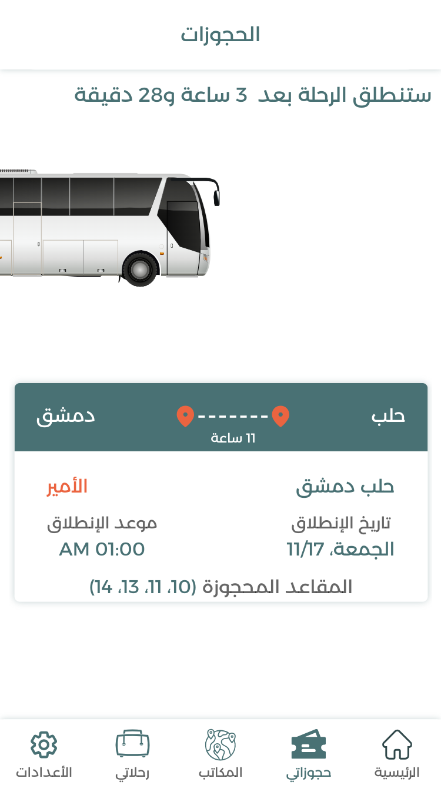 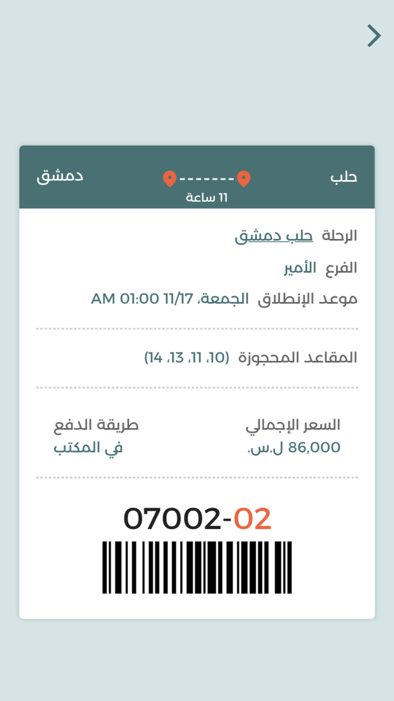  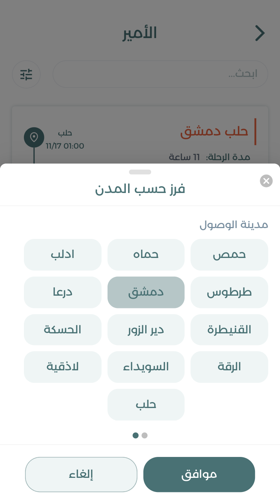  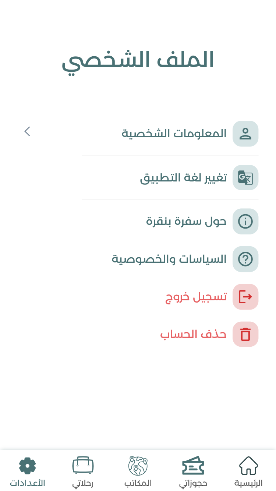  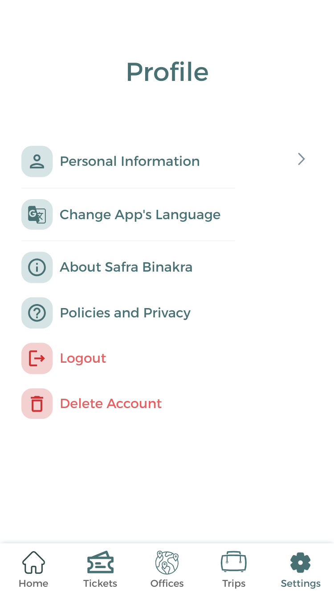

 
### Dashboard

- Show current platform statistics.
- Manage owners, branches and customers.
- Track ongoing trips with the ability to also books seats in realtime.

p]:grid [&>p]:gap-1 [&>p]:md:grid-cols-2 [&_img]:m-0">
  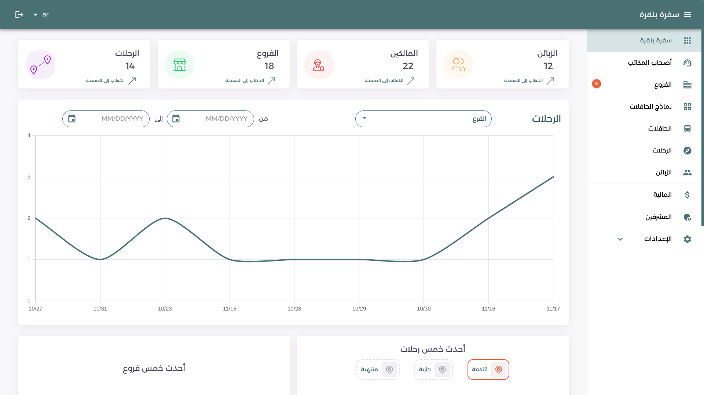 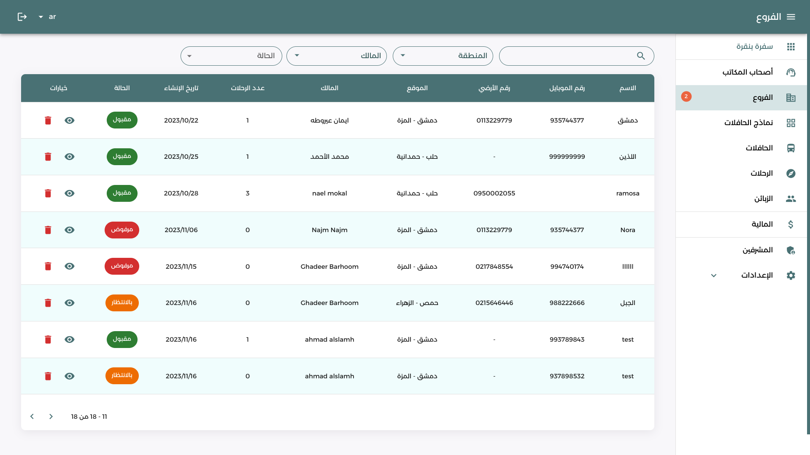  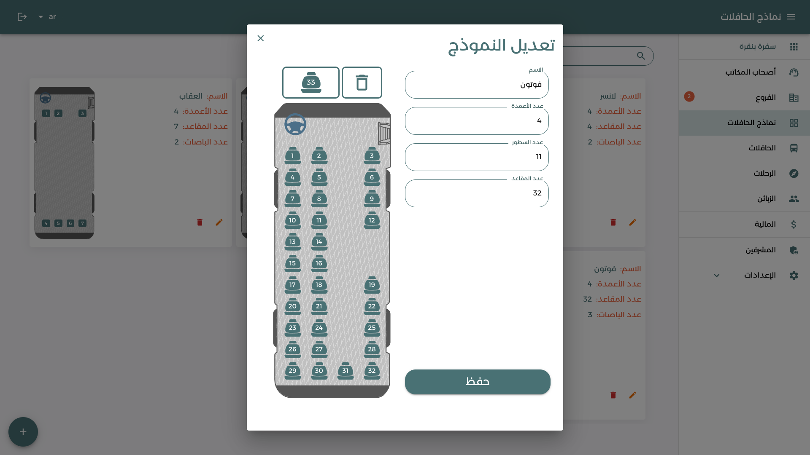
   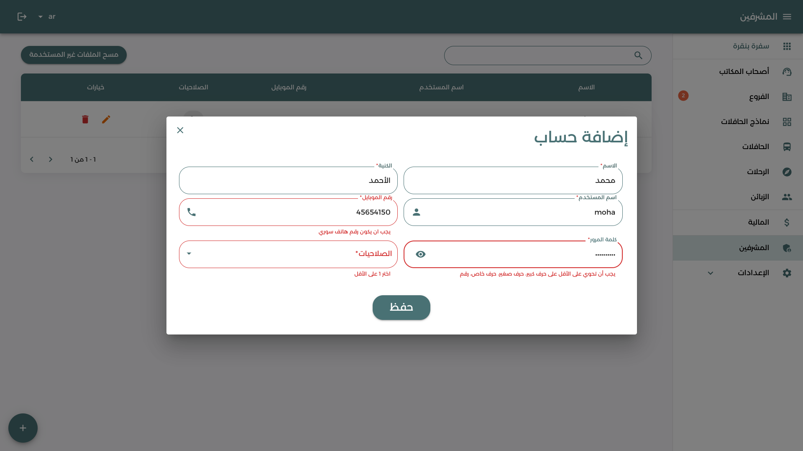
  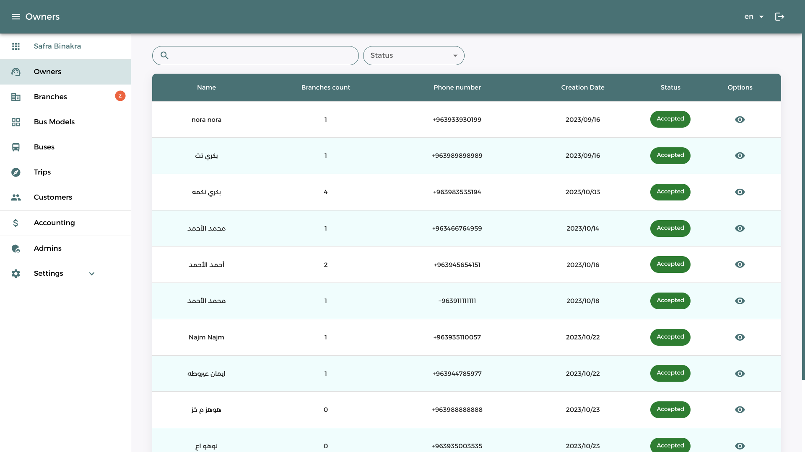 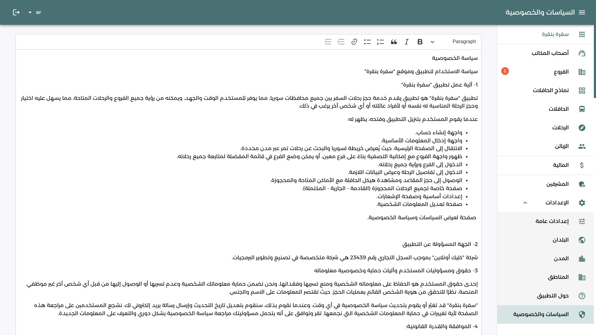
  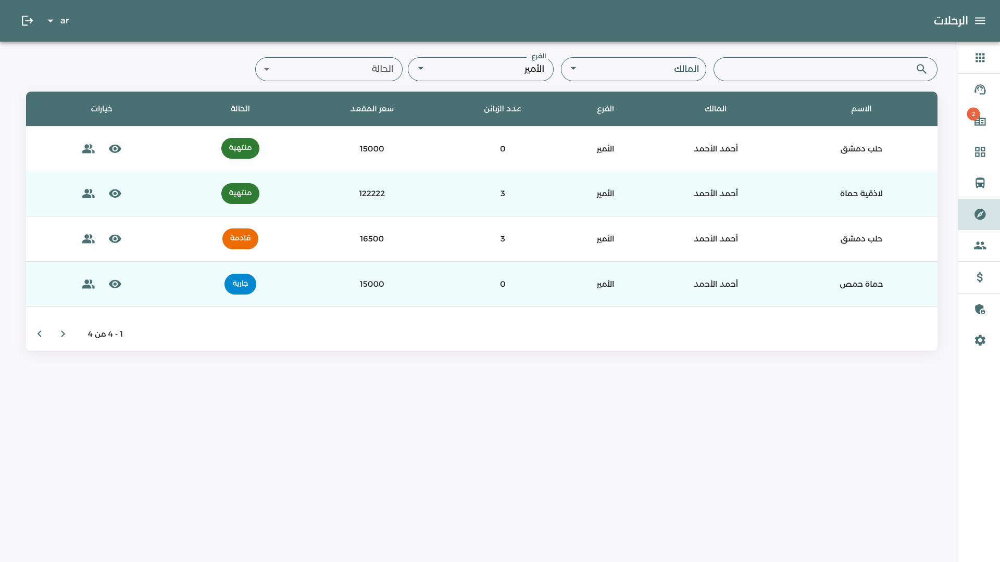 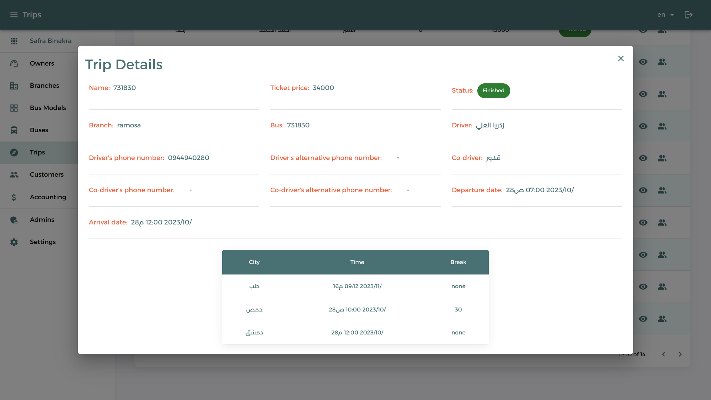
  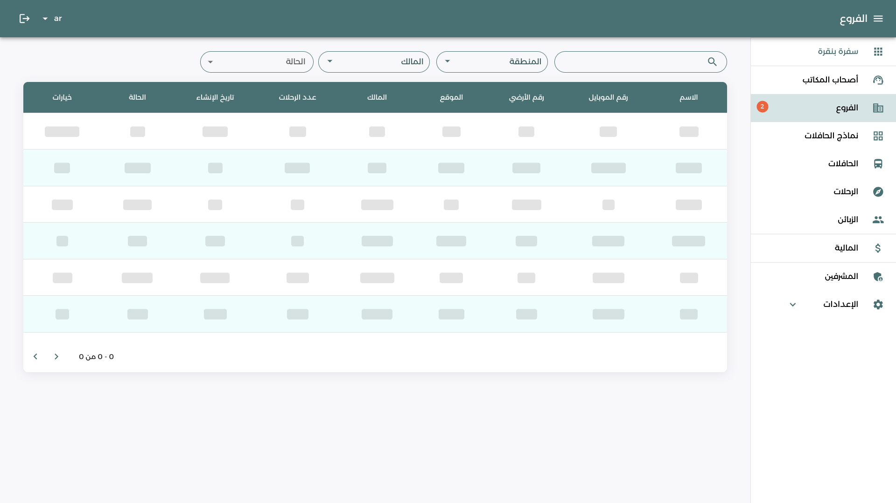

