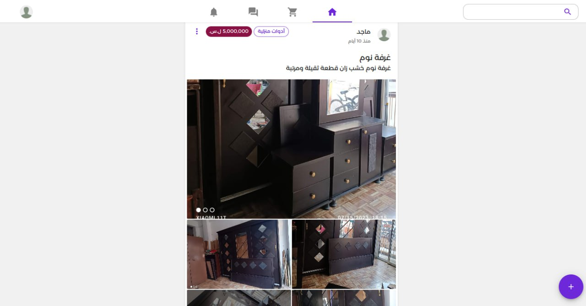
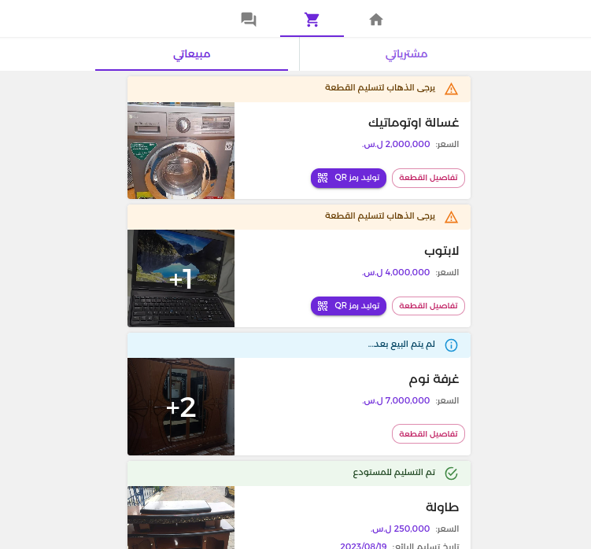
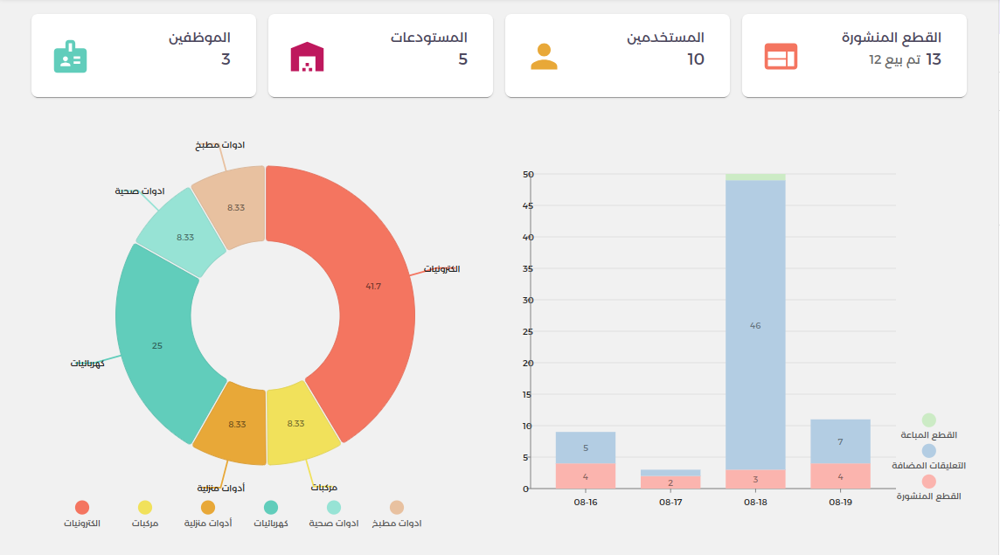
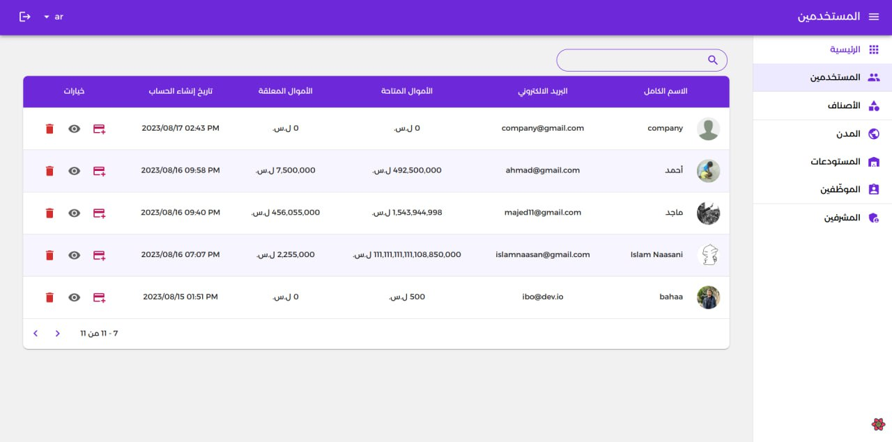

## About

This was a project in 4th year in college, which I've built with my classmates.

The platform aims to help ease selling and buying second-hand items by acting as a intermediary between users (sellers and buyers).

I've built most of the user application and dashboard.

- To review the code: [github.com](https://github.com/I-AM-22/uBay)

### User Application

- Users can posts items for sell
- Comment, like on posted items and start a chat with the seller.
- Realtime chatting
- Generate QR code when handing out/receiving an item from a warehouse employee.

#### User Gallery

p]:grid [&>p]:gap-1 [&>p]:md:grid-cols-2 [&_img]:m-0 [&_img]:object-cover">
       

### Dashboards

- Statistics page built with [nivo](https://nivo.rocks/)
- Tables for viewing and editing all the entities in the platform.

#### Dashboard Gallery

p]:grid [&>p]:gap-1 [&_img]:m-0 [&_img]:object-cover">
   

